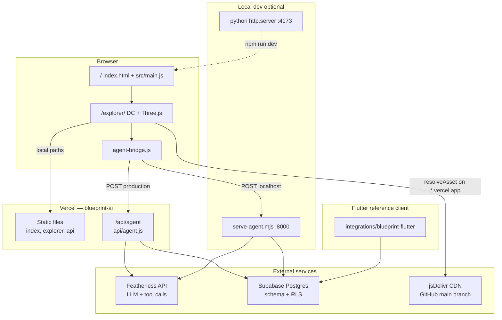
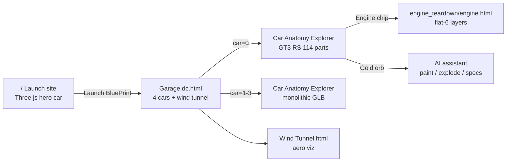
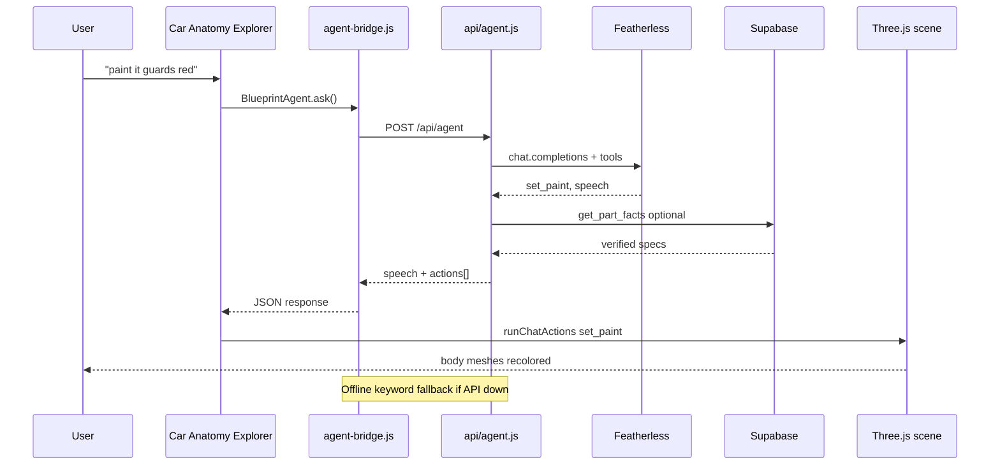
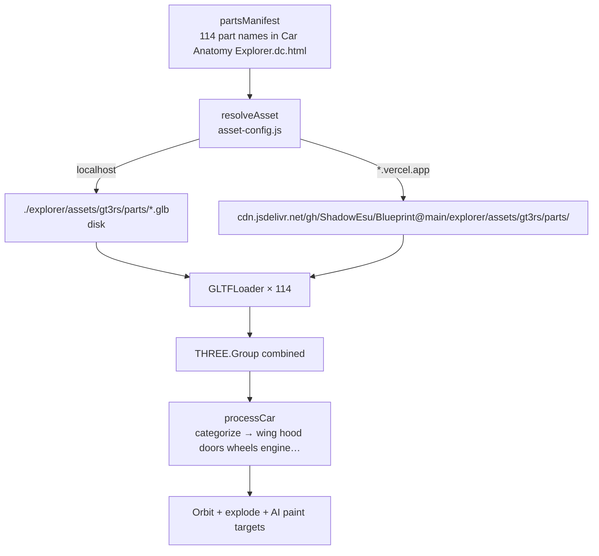
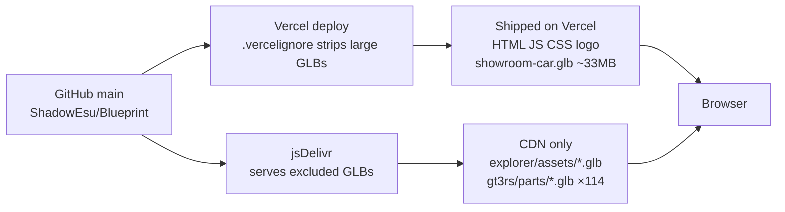
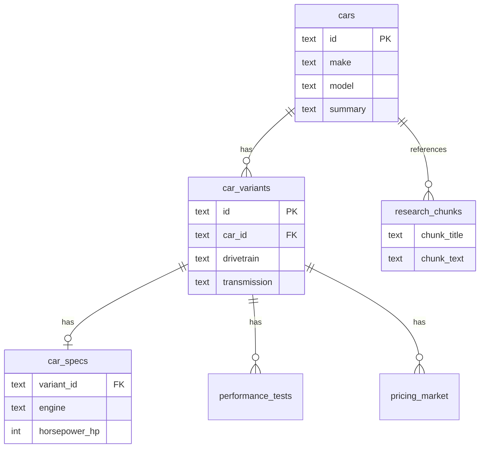
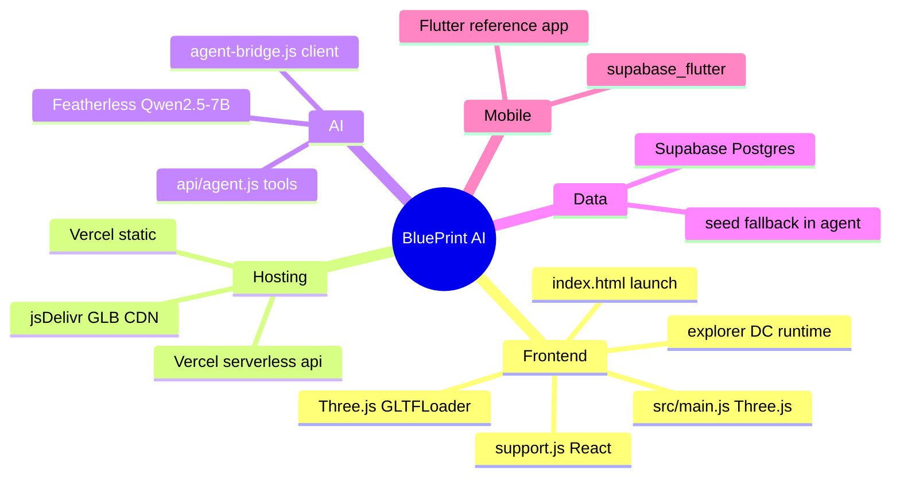

# BluePrint AI

AI-powered 3D car explorer. Launch page, interactive garage, Featherless assistant, Supabase verified specs, Flutter reference client.

**Live:** https://blueprint-ai-kohl.vercel.app  
**Repo:** https://github.com/ShadowEsu/Blueprint

---

## What’s in this repo

| Piece | Path | Purpose |
|-------|------|---------|
| Launch site | `/` (`index.html`, `src/`) | Marketing scroll page + 3D hero car |
| **Final Product** | `/app.html` (`src/app.js`) | **Main app** — 8 machines, explode, paint, AI assistant |
| Explorer | `/explorer/` | Alternate garage / anatomy / wind tunnel |
| AI agent | `/api/agent` (`api/agent.js`) | Featherless LLM + Supabase data tools |
| Health check | `/api/health` | Supabase + provider status |
| Supabase | `supabase/` | Postgres schema, migrations, seed data |
| Flutter | `integrations/blueprint-flutter/` | Mobile reference client (Supabase + AI chat) |
| Local agent | `scripts/serve-agent.mjs` | Dev server for AI on port 8000 |

**Stack:** Static site on Vercel · Three.js 3D · Featherless AI · Supabase Postgres · Flutter (reference)

---

## Architecture (what we actually run)

These diagrams match the real files and services in this repo — not mockups.

### System overview



### User journey (pages)



### AI assistant request flow



### GT3 RS multipart load



### Asset deployment split



### Supabase data layer



Agent reads these tables in `api/agent.js` (service role server-side). Flutter reads with anon key + RLS public read.

### Tech stack map



---

## Quick start (local)

```bash
# 1. Install deps
npm install

# 2. Env (copy template, fill keys — never commit .env)
cp .env.example .env

# 3. Static site
npm run dev
# → http://localhost:4173

# 4. AI agent (separate terminal — required for full assistant)
npm run dev:agent
# → http://127.0.0.1:8000
```

Open http://localhost:4173 → **Launch BluePrint** → Garage.

Do **not** double-click `index.html`. ES modules need a server (`npm run dev` or Vercel).

---

## Live routes

| Page | URL |
|------|-----|
| Launch site | `/` |
| **Final Product (main)** | `/app.html` |
| Health / Supabase check | `/api/health` |
| Garage (explorer) | `/explorer/Garage.dc.html` |
| Car anatomy (3D) | `/explorer/Car%20Anatomy%20Explorer.dc.html` |
| GT3 by index | `/explorer/Car%20Anatomy%20Explorer.dc.html?car=0` |
| Wind tunnel | `/explorer/Wind%20Tunnel.html` |
| GT3 engine teardown | `/explorer/uploads/engine_teardown/engine.html?car=gt3rs` |
| AI API | `POST /api/agent` |

---

## Launch site (`/`)

- Scroll sections: hero, problem, AI stack (Featherless / FlutterAI / Supabase), launch CTA
- **Launch BluePrint** and **Launch App** → `/explorer/Garage.dc.html`
- Hero 3D car: `assets/blueprint-showroom-car.glb` (deployed on Vercel; mobile loads a fast fallback first)
- Styles: `src/styles.css` · Scene: `src/main.js` (Three.js via import map)

---

## Explorer (`/explorer/`)

Interactive Car Assembly Explorer 2 — the main product.

### Garage

Four cars, each opens the anatomy viewer:

| Index | Car | Notes |
|-------|-----|--------|
| `0` | Porsche 911 GT3 RS | **114-part multipart assembly** (`assets/gt3rs/parts/`) |
| `1` | Ferrari LaFerrari | Monolithic GLB |
| `2` | Porsche 911 Turbo | Monolithic GLB |
| `3` | Lamborghini Aventador SVJ | Monolithic GLB |

Also links to **Wind Tunnel** aerodynamics view.

### Car Anatomy Explorer

- Orbit, zoom, click parts, explode slider, category chips (wing, hood, doors, wheels, engine, exhaust, interior)
- **GT3 RS engine chip** → engine teardown page (not generic engine select)
- **AI orb** (bottom right) → assistant chat

Runtime: `support.js` (DC/React) + Three.js import map + `asset-config.js` for CDN paths.

### GT3 RS model

Uses `partsManifest` + `partsBase`, not the old single `porsche_gt3_rs.glb`:

```
explorer/assets/gt3rs/parts/*.glb   # 114 segmented parts
```

Part names are categorized in `Car Anatomy Explorer.dc.html` (`categorize()` for wing, hood, doors, wheels, engine, etc.).

On Vercel, these parts load from **jsDelivr** (GitHub `main` branch) because they exceed deploy size limits. First load can take 30–60s while the CDN warms up. Locally they load from disk instantly.

### Wind Tunnel

Illustrative airflow over four monolithic GLB models (`explorer/assets/*.glb`).

### Engine teardown

`explorer/uploads/engine_teardown/engine.html?car=gt3rs` — layered flat-6 teardown with explode slider.

---

## AI assistant

### How it works

1. User types in the gold orb chat (Car Anatomy Explorer)
2. `explorer/agent-bridge.js` sends `POST` to:
   - **Production:** `/api/agent`
   - **Local:** `http://127.0.0.1:8000/` (run `npm run dev:agent`)
3. `api/agent.js` calls **Featherless** (OpenAI-compatible) with tool calling
4. Supabase (or in-memory seed) backs factual answers
5. Client runs **scene actions** on the live Three.js model

If the API is unreachable, a **keyword offline fallback** still handles paint / explode / reset / show engine.

### Scene tools (client executes these)

| Tool | What it does |
|------|----------------|
| `set_paint` | Change body/hood/door paint (name or hex) |
| `focus_camera` | Frame a part or angle (front, rear, engine, …) |
| `highlight` | Cyan emissive glow on a part |
| `explode` | Exploded view (whole car or single part) |
| `isolate` | Hide everything except one part |
| `reset_view` | Reassemble, restore visibility, reset camera |
| `show_specs` | Select part + info card |

### Named paint colors

Guards Red, Nardo Grey, Racing Green, Blueprint Blue, plus red, blue, green, black, white, silver, yellow, orange, purple, gold, pink, or any hex.

### Example prompts

- `paint it guards red`
- `make it Nardo grey`
- `show the engine`
- `explode the car`
- `isolate the wheels`
- `reset view`
- `what's the horsepower?` (uses Supabase / seed data)

### Data tools (server only)

`get_part_facts`, `get_overview`, `get_performance`, `get_pricing`, `search_knowledge`, `find_car`

---

## Supabase

- **Schema:** `supabase/schema.sql`
- **Migration:** `supabase/migrations/20260626000000_blueprint_schema.sql`
- **Tables:** cars, car_variants, car_specs, performance_tests, pricing_market, research_chunks, etc.
- **RLS:** public read, private write — anon/publishable key in clients, **never** service role in browser
- **Fallback:** agent uses embedded seed data if Supabase is unavailable

Apply schema in Supabase SQL editor or via CLI. See `supabase/README.md`.

Duplicate Deno edge function lives under `agent/supabase/functions/agent/` (same logic as `api/agent.js` for Supabase-hosted deploys).

---

## Flutter (`integrations/blueprint-flutter/`)

Reference mobile client: car list, detail, compare, AI chat screen.

```bash
cd integrations/blueprint-flutter
flutter pub get
# Copy .env.example → .env with SUPABASE_URL + SUPABASE_ANON_KEY
flutter run
```

More detail: `integrations/blueprint-flutter/README.md`, `SETUP_GUIDE.md`, `COMMANDS.md`.

---

## Environment variables

Copy `.env.example` → `.env` at repo root. **Never commit `.env`.**

| Variable | Used for |
|----------|----------|
| `FEATHERLESS_API_KEY` | Featherless LLM |
| `LLM_PROVIDER` | `featherless` (default) or `openai` |
| `ATLAS_MODEL` | e.g. `Qwen/Qwen2.5-7B-Instruct` |
| `OPENAI_API_KEY` | If using OpenAI instead |
| `SUPABASE_URL` | Agent data lookups |
| `SUPABASE_SERVICE_ROLE_KEY` | Server-side agent only |
| `SUPABASE_ANON_KEY` / `SUPABASE_PUBLISHABLE_KEY` | Optional read client |
| `AGENT_PORT` | Local agent port (default `8000`) |

Set the same vars in **Vercel → Project → Environment Variables** for production AI.

---

## Vercel deployment

```bash
npx vercel deploy --prod
```

- **Config:** `vercel.json` — static root `.`, serverless `api/agent.js` (10s max on Hobby)
- **Ignore large assets:** `.vercelignore` excludes multi‑MB GLBs; they load from jsDelivr on `*.vercel.app`
- **CDN resolver:** `explorer/asset-config.js` → `resolveAsset('./path')` rewrites to  
  `https://cdn.jsdelivr.net/gh/ShadowEsu/Blueprint@main/explorer/...?v=gt3parts2`
- **Showroom GLB** (`assets/blueprint-showroom-car.glb`) is included in deploy (~33MB) for the launch hero

After pushing to `main`, jsDelivr picks up new explorer assets within a few minutes.

---

## Project layout

```
index.html                 Launch page
src/main.js                Hero Three.js + scroll sections
src/styles.css
assets/                    Logo, Featherless SVG, showroom GLB

explorer/
  Garage.dc.html           Car picker
  Car Anatomy Explorer.dc.html   Main 3D viewer + AI
  Wind Tunnel.html
  asset-config.js          CDN path helper
  agent-bridge.js          Browser → /api/agent
  support.js               DC runtime (React + templates)
  assets/                  Monolithic car GLBs
  assets/gt3rs/parts/      GT3 RS multipart (114 GLBs)
  uploads/engine_teardown/ GT3 engine teardown

api/agent.js               Vercel serverless AI
scripts/serve-agent.mjs    Local AI dev server

supabase/                  Schema + migrations
integrations/blueprint-flutter/   Flutter app
```

---

## npm scripts

| Script | Command | Port |
|--------|---------|------|
| `npm run dev` | `python3 -m http.server 4173` | 4173 |
| `npm run dev:agent` | `node scripts/serve-agent.mjs` | 8000 |
| `npm run build` | No-op (static site) | — |

---

## Troubleshooting

**Blank page / modules fail**  
Use `npm run dev` or the Vercel URL. Don't open HTML files directly (`file://`).

**GT3 RS not showing on Vercel**  
Wait for 114 parts to load from jsDelivr (first visit is slow). Hard refresh. For instant loads, use local dev. Ensure GitHub `main` has the latest `explorer/assets/gt3rs/parts/`.

**Assistant says unavailable**  
Run `npm run dev:agent` locally. On Vercel, check env vars and `/api/agent` returns 200.

**Paint / colors don't change**  
Use the anatomy explorer orb (not wind tunnel). Try `paint it red`. Needs `agent-bridge.js` + scene handlers in `Car Anatomy Explorer.dc.html`.

**Hero car missing on launch page**  
Hard refresh. Mobile shows a fast LaFerrari first, then upgrades to the full showroom model.

**AI timeout on Vercel Hobby**  
Agent is tuned for ~8s responses. Very long prompts may hit the 10s function limit.

---

## License / assets

3D models carry their own attributions in-app (Sketchfab CC BY 4.0 where noted). GT3 multipart assembly is Blueprint explorer assets.
